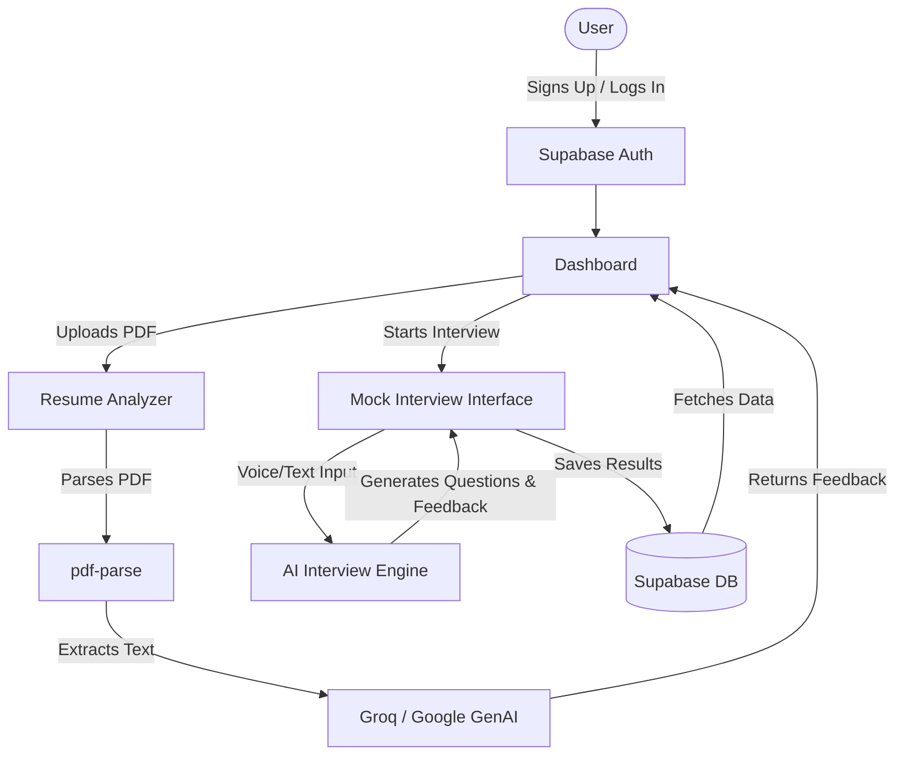

<div align="center">
  <h1>🤖 MockMate AI</h1>
  <p><strong>Your Ultimate AI-Powered Mock Interview & Resume Assistant</strong></p>
  
  <p>
    <a href="#features">Features</a> •
    <a href="#how-it-works">How It Works</a> •
    <a href="#tech-stack">Tech Stack</a> •
    <a href="#setup--deployment">Setup</a> •
    <a href="#future-scope">Future Scope</a>
  </p>

  <p>
   
    
    
    
    
    
   
  </p>

  <p>
    <em>Live Demo: <a href="#">mockmate-ai.vercel.app</a></em> (Update link when deployed)
  </p>
</div>

---

## 🎯 What it does
**MockMate AI** is a comprehensive platform designed to help job seekers crack their dream interviews. It leverages cutting-edge Generative AI (Groq & Google GenAI) to conduct realistic, dynamic mock interviews tailored to specific roles. 

Beyond interviews, it features a powerful resume parser and analyzer that provides actionable feedback on your CV, ensuring you stand out to recruiters before the interview even begins. Complete with a stunning 3D interactive UI, real-time performance tracking, and seamless authentication.


---

## ✨ Feature Blocks

| Feature | Description |
| :--- | :--- |
| **🤖 AI Mock Interviews** | Role-specific, real-time interview simulations powered by Groq and Google GenAI. |
| **📄 Resume Analyzer** | Upload your PDF resume to get instant, AI-driven feedback, keyword extraction, and score. |
| **📊 Performance Dashboard** | Track your interview progress over time with beautiful interactive charts (Recharts). |
| **🎮 Interactive 3D UI** | Engaging, dynamic 3D elements built with Three.js and React Three Fiber for a premium feel. |
| **🔐 Secure Authentication** | Fast and secure user login, signup, and session management using Supabase. |

---

## 🏗 Architecture / Workflow



---

## 📂 Folder Structure

```text
mockmate-ai/
├── app/                  # Next.js 15+ App Router routes
│   ├── api/              # Backend API routes (AI integrations, parsing)
│   ├── dashboard/        # User analytics and performance charts
│   ├── interview/        # Interactive mock interview environment
│   ├── resume/           # Resume upload and analysis tools
│   ├── login/            # Authentication: Login page
│   └── signup/           # Authentication: Signup page
├── components/           # Reusable React components
│   ├── background/       # Animated / 3D background elements
│   ├── layout/           # Shared layout components (Headers, Footers)
│   ├── ui/               # Base UI components (Buttons, Inputs, Cards)
│   ├── HeroRobot.tsx     # 3D Three.js interactive robot component
│   └── Navbar.tsx        # Global navigation bar
├── lib/                  # Utility functions and configurations
│   ├── supabase.ts       # Supabase client config & helpers
│   └── supabase-client.ts# Client-side Supabase instances
├── public/               # Static assets (images, fonts, icons)
├── package.json          # Project dependencies & scripts
└── next.config.ts        # Next.js configuration
```

---

## 🚀 Setup & Deployment


### Local Setup

1. **Clone the repository:**
   ```bash
   git clone https://github.com/Santhoshcv07/MockMate-AI.git
   cd MockMate-AI
   ```

2. **Install dependencies:**
   ```bash
   npm install
   ```

3. **Configure Environment Variables:**
   Rename `.env.local.example` to `.env.local` (or just create `.env.local`) and add your keys:
   ```env
   NEXT_PUBLIC_SUPABASE_URL=your_supabase_url
   NEXT_PUBLIC_SUPABASE_ANON_KEY=your_supabase_anon_key
   GROQ_API_KEY=your_groq_api_key
   GEMINI_API_KEY=your_google_genai_key
   ```

4. **Run the Development Server:**
   ```bash
   npm run dev
   ```
   Open [http://localhost:3000](http://localhost:3000) to view the app!

### Deployment
The easiest way to deploy this Next.js app is on **Vercel**:
1. Push your code to GitHub.
2. Import the project in Vercel.
3. Add your Environment Variables in the Vercel dashboard.
4. Click **Deploy**.

---

## 🔮 Future Scope

- [ ] **Voice-to-Voice Interviews:** Real-time speech recognition and AI voice synthesis for a completely hands-free experience.
- [ ] **Industry-Specific Paths:** Tailored interview modules for Software Engineering, Product Management, Finance, etc.
- [ ] **Peer-to-Peer Mock Interviews:** Connect with other job seekers for live practice sessions.
- [ ] **Browser Extension:** One-click resume parsing directly from LinkedIn profiles.

---

## 💡 Use Cases

- **Students & Recent Grads:** Practice basic interview etiquette and get baseline feedback on entry-level resumes.
- **Mid-Career Professionals:** Simulate grueling technical rounds or behavioral (STAR method) interviews.
- **Career Coaches / Bootcamps:** Provide students with an always-available tool to refine their skills before actual client placements.

---

## 🤝 Contribution

Contributions make the open-source community an amazing place to learn, inspire, and create. Any contributions you make are **greatly appreciated**.

1. Fork the Project
2. Create your Feature Branch (`git checkout -b feature/AmazingFeature`)
3. Commit your Changes (`git commit -m 'Add some AmazingFeature'`)
4. Push to the Branch (`git push origin feature/AmazingFeature`)
5. Open a Pull Request

---

<div align="center">
  <p>Built with ❤️ by <a href="https://github.com/Santhoshcv07">Santhosh</a></p>
</div>
